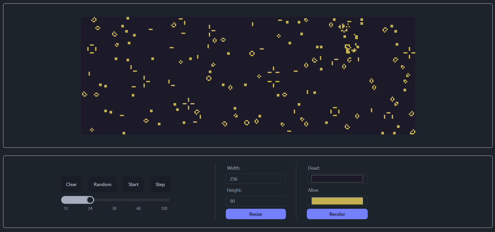

# Conway's Game of Life

Conway's Game of Life implemented using Angular and Typescript and a nice UI using TailwindCSS and DaisyUI.

The purpose of this project was to learn a little bit about Cellular Automata and the Conway's Game of Life itself.

## You can "play" with it [here](https://gameoflife.douglasonofre.com.br).

### Screenshot:

